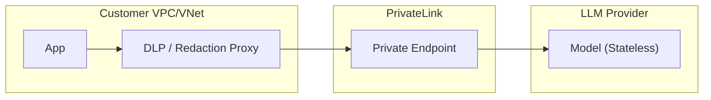

# 🛡️ Zero-Retention Database for LLM Providers

A comprehensive, industry-standard guide to **Zero-Retention (ZDR)** endpoints across major Enterprise LLM providers. This repository provides technical controls, contract requirements, and configuration steps for regulated industries (Finance, Healthcare, Legal) requiring strict data privacy.

---

## 📑 Table of Contents
- [Executive Summary](#executive-summary)
- [Terminology & Evaluation Criteria](#terminology--evaluation-criteria)
- [Tier 1: Major US Cloud Providers](#tier-1-major-us-cloud-providers)
  - [OpenAI](#openai)
  - [Anthropic](#anthropic)
  - [Google Vertex AI](#google-vertex-ai)
  - [Microsoft Azure OpenAI](#microsoft-azure-openai)
  - [Amazon Bedrock](#amazon-bedrock)
- [Tier 2: Reasoning & Deep Research Models](#tier-2-reasoning--deep-research-models)
- [Tier 3: Chinese & International Providers](#tier-3-chinese--international-providers)
- [Gateways & Enterprise Routers](#gateways--enterprise-routers)
- [Global Comparison Table](#global-comparison-table)
- [Verification & Audit Guide](#verification--audit-guide)
- [Architecture Blueprints](#architecture-blueprints)
- [Contributing](#contributing)

---

## 🚀 Executive Summary

"Zero-retention" is not a single feature; it is a **bundle of technical controls + contract terms** ensuring customer content (prompts, outputs, files) is not stored at rest by the vendor.

### Key Patterns
- **Hyperscalers (AWS, Azure, OCI)**: Position base inference as "no storage by default," with optional logging.
- **Model Native APIs (OpenAI, Anthropic)**: Provide ZDR as an **approved enterprise setting** governed by contract.
- **Sovereign/Chinese Models**: Primarily rely on **Private Cloud/VPC** or **Self-Hosting** to guarantee non-retention.

---

## 🔍 Terminology & Evaluation Criteria

- **Customer Content**: Prompts, outputs, and uploaded files.
- **Abuse Monitoring**: Safety logs used to detect misuse (often the primary "retention" loophole).
- **Application State**: Stateful features (Threads, Vector Stores) that require TTL-based storage.
- **System Data**: Billing metadata, token counts (usually excluded from ZDR).

---

## 🏢 Tier 1: Major US Cloud Providers

### OpenAI
- **Control Name**: Zero Data Retention (ZDR) / Modified Abuse Monitoring (MAM).
- **Setup**: Approval required → Dashboard: **Settings → Organization → Data controls**.
- **Caveat**: Prompt Caching and Assistants API are NOT ZDR-eligible.

### Anthropic
- **Control Name**: ZDR Arrangement / HIPAA-Ready Organization.
- **Setup**: Contract addendum required. Use the Messages API with `inference_geo` control.
- **Caveat**: Flagged misuse may be retained for up to 2 years under safety exceptions.

### Google Vertex AI
- **Control Name**: Vertex AI Zero Data Retention Posture.
- **Setup**: Request **Abuse Monitoring Exception**. Disable BigQuery request/response logging.
- **Caveat**: Grounding with Google Search/Maps breaks strict ZDR (30-day storage for logs).

---

## 🧠 Tier 2: Reasoning & Deep Research Models

| Provider | Model | Native ZDR API? | Reasoning Tokens Covered? | Verification Method |
| :--- | :--- | :--- | :--- | :--- |
| **OpenAI** | o1, o3-mini | **Yes** | Yes (via encrypted items) | Pass `reasoning.encrypted_content` |
| **Anthropic** | Claude Thinking | **Yes** | Yes (ZDR-eligible) | In-memory processing only |
| **Google** | Gemini Thinking | **Yes** | Yes | Follows Vertex AI Exception |

---

## 🔀 Gateways & Enterprise Routers

Enterprise gateways allow you to enforce ZDR policies across multiple upstream providers through a unified interface.

| Gateway | ZDR Feature | Primary Use Case |
| :--- | :--- | :--- |
| **OpenRouter** | `zdr: true` parameter | Unified routing with privacy enforcement. |
| **Together AI** | Dashboard Privacy Toggle | High-performance inference for open-weights models. |
| **Cloudflare AI Gateway** | Zero Data Retention Toggle | Observability + Privacy for multiple providers. |
| **Portkey.ai** | Log Redaction & Vault | Enterprise-grade orchestration and compliance. |

---
| Provider | Mechanism | How to Enable | Private Networking |
| :--- | :--- | :--- | :--- |
| **OpenAI** | ZDR/MAM | Sales Approval | Public SaaS Only |
| **Azure OpenAI** | Opt-out | ContentLogging: false | Azure Private Endpoint |
| **AWS Bedrock** | Default | No Logging Opt-in | AWS PrivateLink |
| **DeepSeek** | Open Source | Deploy via vLLM | Full VPC Isolation |

---

## 🛡️ Verification & Audit Guide

A credible ZDR audit requires **Four Pillars of Evidence**:
1. **Configuration Artifacts**: CLI output showing `ContentLogging: false`.
2. **Negative Tests**: Attempt to retrieve a completion by ID; confirm `404 Not Found`.
3. **Environment Logs**: Ensure your own WAF/Gateway isn't logging payloads.
4. **Contractual Proof**: Signed DPA or ZDR Addendum.

---

## 📐 Architecture Blueprints

### VPC-Native Isolated Pattern

---

## 🤝 Contributing
We welcome contributions! Please see [CONTRIBUTING.md](CONTRIBUTING.md) for guidelines on how to add new providers or update existing ones.

---

## ⚖️ License
Licensed under the Apache License, Version 2.0. See [LICENSE](LICENSE) for details.
