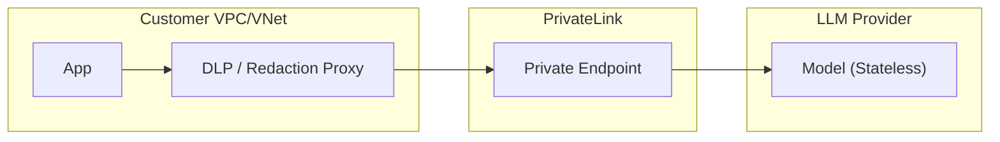

# 🛡️ Zero-Retention Database for LLM Providers

[](https://opensource.org/licenses/Apache-2.0)
[](https://GitHub.com/zdr-database/zdr/graphs/commit-activity)
[](http://makeapullrequest.com)

A comprehensive, industry-standard guide to **Zero-Retention (ZDR)** endpoints across major Enterprise LLM providers. This repository provides technical controls, contract requirements, and configuration steps for regulated industries (Finance, Healthcare, Legal) requiring strict data privacy.

---

## 📑 Table of Contents
- [Executive Summary](#executive-summary)
- [Terminology & Evaluation Criteria](#terminology--evaluation-criteria)
- [Major US Cloud Providers](#major-us-cloud-providers)
- [Reasoning & Deep Research Models](#reasoning--deep-research-models)
- [Chinese & International Providers](#chinese--international-providers)
- [Gateways & Enterprise Routers (Deep Dive: OpenRouter)](#gateways--enterprise-routers)
- [Global Comparison Table](#global-comparison-table)
- [Verification & Audit Guide](#verification--audit-guide)
- [Architecture Blueprints](#architecture-blueprints)
- [Contributing](#contributing)

---

## 🚀 Executive Summary

"Zero-retention" is not a single feature; it is a **bundle of technical controls + contract terms** ensuring customer content (prompts, outputs, files) is not stored at rest by the vendor.

### Key Patterns
- **Hyperscalers (AWS, Azure, OCI)**: Position base inference as "no storage by default," with optional logging.
- **Model Native APIs (OpenAI, Anthropic)**: Provide ZDR as an **approved enterprise setting** governed by contract.
- **Sovereign/Chinese Models**: Primarily rely on **Private Cloud/VPC** or **Self-Hosting** to guarantee non-retention.

---

## 🔍 Terminology & Evaluation Criteria

- **Customer Content**: Prompts, outputs, and uploaded files.
- **Abuse Monitoring**: Safety logs used to detect misuse (often the primary "retention" loophole).
- **Application State**: Stateful features (Threads, Vector Stores) that require TTL-based storage.
- **System Data**: Billing metadata, token counts (usually excluded from ZDR).

---

## 🏢 Major US Cloud Providers

### [OpenAI](https://platform.openai.com/docs/models#data-security-and-privacy)
- **Control Name**: Zero Data Retention (ZDR) / Modified Abuse Monitoring (MAM).
- **Setup**: Approval required. Once approved via enterprise sales, configure in the Dashboard: **Settings → Organization → Data controls**.
- **Caveat**: Prompt Caching and Assistants API are NOT ZDR-eligible as they rely on server-side state.

### [Anthropic](https://support.anthropic.com/en/articles/9036730-does-anthropic-train-on-my-data)
- **Control Name**: ZDR Arrangement / HIPAA-Ready Organization.
- **Setup**: Contract addendum required via enterprise team. Use the Messages API with `inference_geo` control.
- **Caveat**: Even with ZDR, flagged misuse may be retained for up to 2 years under strict trust & safety exceptions unless specifically negotiated otherwise.

### [Google Vertex AI](https://cloud.google.com/vertex-ai/docs/generative-ai/data-governance)
- **Control Name**: Vertex AI Zero Data Retention Posture.
- **Setup**: Request an **Abuse Monitoring Exception** via Google Support. Ensure BigQuery request/response logging is disabled in the project.
- **Caveat**: Grounding with Google Search/Maps breaks strict ZDR, as logs are stored for 30 days for debugging.

---

## 🧠 Reasoning & Deep Research Models

Advanced reasoning models process "thinking tokens" or internal states. ZDR for these models requires specific architectural patterns to ensure reasoning states aren't stored server-side.

| Provider | Model | Native ZDR API? | Reasoning Tokens Covered? | Verification Method |
| :--- | :--- | :--- | :--- | :--- |
| **OpenAI** | o3-mini, GPT-4.5 | **Yes** | Yes (via encrypted items) | Must pass `reasoning.encrypted_content` back to maintain state |
| **Anthropic** | Claude 3.7 Sonnet (Thinking) | **Yes** | Yes (ZDR-eligible) | Handled purely in-memory; discarded post-generation |
| **Google** | Gemini 2.5 Pro / Flash Thinking | **Yes** | Yes | Follows Vertex AI Abuse Exception rules |

---

## 🌏 Chinese & International Providers

Major Chinese providers typically do not offer a simple "one-click" ZDR toggle for public APIs due to local compliance and safety regulations. Enterprise privacy is achieved via **Private Cloud**, **VPC Deployments**, or **Self-Hosting**.

| Provider | Model | Privacy Strategy | ZDR Readiness |
| :--- | :--- | :--- | :--- |
| **DeepSeek** | DeepSeek-R1 / V3.2 | **Self-Hosting (MIT License)** | Full (if hosted on your infra via vLLM/SGLang) |
| **Zhipu AI** | GLM-5 | Private VPC Deployment | Enterprise Only (Dedicated clusters) |
| **Moonshot** | Kimi K2.5 | Route via Gateways (e.g., OpenRouter) | Limited (Only the router enforces ZDR) |
| **Alibaba** | Qwen 3.5 Omni / Qwen 2.5-VL | Alibaba Cloud PAI-EAS | High (Dedicated isolation and compute) |

---

## 🔀 Gateways & Enterprise Routers

Enterprise gateways allow you to enforce ZDR policies across multiple upstream providers through a unified interface. 

### Deep Dive: [OpenRouter](https://openrouter.ai/docs/privacy)
OpenRouter acts as a router to dozens of API providers. It natively supports a strict ZDR policy, ensuring neither OpenRouter nor the upstream provider stores your data.

**How to Enforce ZDR on OpenRouter:**
1. **Account-Wide Setting**: Navigate to `Settings -> Privacy` in the OpenRouter dashboard and toggle "Only allow Zero Data Retention providers."
2. **API Level (Per Request)**: Pass the `zdr: true` flag in the request body. If the chosen model's provider does not support ZDR, the request will fail cleanly rather than compromising privacy.
   ```json
   {
     "model": "anthropic/claude-3.5-sonnet",
     "messages": [{"role": "user", "content": "Hello"}],
     "zdr": true
   }
   ```
**Crucial OpenRouter Privacy Caveats:**
- 🚨 **Prompt Logging Discount**: OpenRouter offers a 1% cost discount if you opt into "Prompt Logging". **Enabling this gives OpenRouter the right to use your data commercially.** If privacy is your goal, ensure this is disabled.
- **Provider Filtering**: Passing `zdr: true` automatically filters out providers who haven't signed ZDR agreements with OpenRouter. Providers commonly supporting ZDR via OpenRouter include Google (Vertex), Amazon (Bedrock), DeepInfra, and NovitaAI.

### Other Notable Gateways

| Gateway | ZDR Feature | Primary Use Case |
| :--- | :--- | :--- |
| **Together AI** | [Dashboard Privacy Toggle](https://docs.together.ai/docs/privacy) | High-performance inference for open-weights models. |
| **Cloudflare AI Gateway** | [Zero Data Retention Toggle](https://developers.cloudflare.com/ai-gateway/observability/logging/) | Edge observability + Privacy for multiple providers. |
| **Portkey.ai** | Log Redaction & Vault | Enterprise-grade orchestration, guardrails, and compliance. |

---

## 🗺️ Global Comparison Table

| Provider | Mechanism | How to Enable | Private Networking |
| :--- | :--- | :--- | :--- |
| **OpenAI** | ZDR/MAM | Sales Approval | Public SaaS Only |
| **Azure OpenAI** | Opt-out | `ContentLogging: false` | Azure Private Endpoint |
| **AWS Bedrock** | Default | No Logging Opt-in | AWS PrivateLink |
| **DeepSeek** | Open Source | Deploy via vLLM | Full VPC Isolation |

---

## 🛡️ Verification & Audit Guide

A credible ZDR audit requires **Four Pillars of Evidence**:
1. **Configuration Artifacts**: CLI/Dashboard outputs showing features like `ContentLogging: false`.
2. **Negative Tests**: Attempt to retrieve a completion by ID or retrieve a Thread; confirm `404 Not Found` or standard failures.
3. **Environment Logs**: Ensure your own WAF/Gateway isn't logging payloads (Log Redaction).
4. **Contractual Proof**: Signed BAA, DPA, or specific ZDR Addendums with the provider.

---

## 📐 Architecture Blueprints

### VPC-Native Isolated Pattern


---

## 🤝 Contributing
We welcome contributions! Please see [CONTRIBUTING.md](CONTRIBUTING.md) for guidelines on how to add new providers or update existing ones.

---

## ⚖️ License
Licensed under the Apache License, Version 2.0. See [LICENSE](LICENSE) for details.
