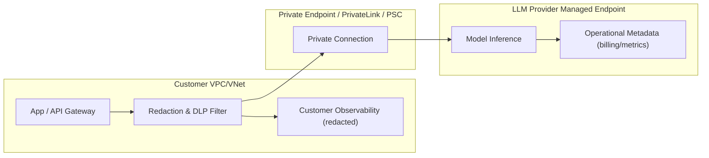
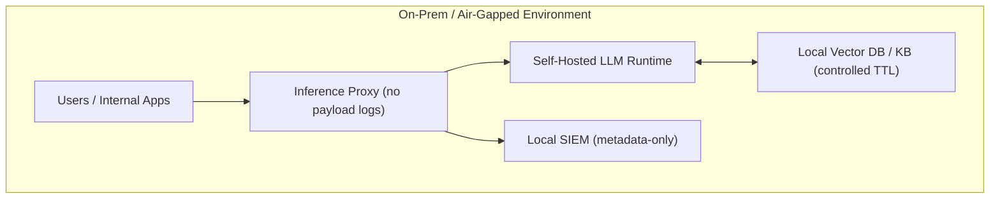
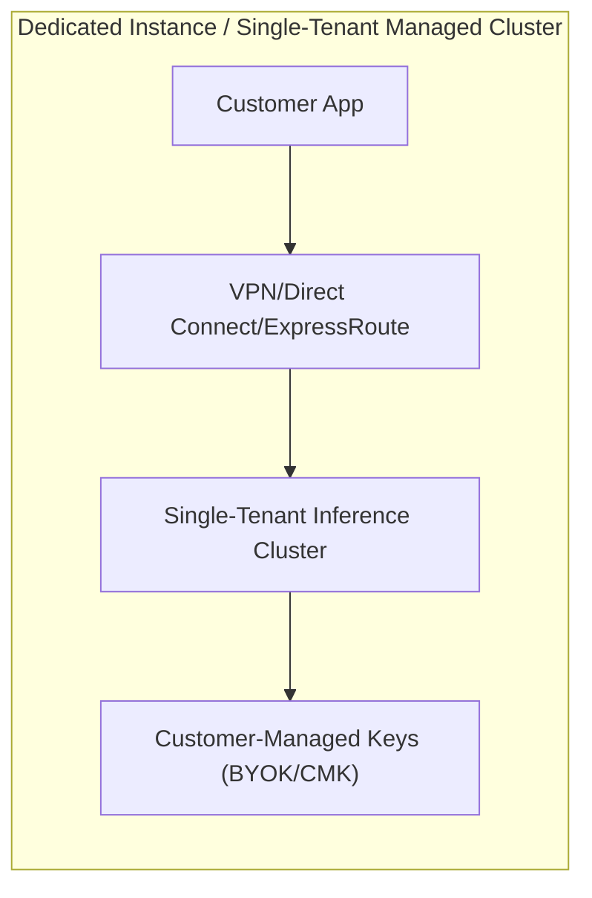

# Zero-Retention Endpoints for Enterprise LLM Providers

## Executive summary

“Zero-retention” for LLM APIs is not a single standardized claim; it is a bundle of **technical controls + contract terms** that determine whether *customer content* (prompts, model outputs, uploaded files, tool inputs) is **stored at rest** by the vendor after serving the response, and what exceptions apply (abuse, fraud, legal hold, malware/CSAM scanning, billing/diagnostic metadata). citeturn30view0turn14view0turn5search29turn22view1turn16view0

Across major providers, patterns emerge:

**Hyperscaler “model platforms”** (notably **Amazon Bedrock**, **OCI Generative AI**, and **IBM watsonx.ai**) often position the base inference path as “no prompt/response storage by the platform,” while offering **optional logging** or **stateful add-ons** (agents, knowledge bases, fine-tuning) that store data unless you configure them carefully. citeturn16view0turn27search5turn26search0turn16view1

**Model builders’ native APIs** (notably **OpenAI** and **Anthropic**) typically provide **enterprise-grade Zero Data Retention (ZDR)** or equivalent as an **approved setting** governed by contract and account configuration, with clear lists of **ineligible endpoints/features** and **exception handling**. citeturn30view0turn14view0turn28view0

**Google Vertex AI** offers an explicit **“zero data retention”** posture that depends on (a) whether you are in-scope for **prompt logging for abuse monitoring**, (b) whether you have an approved **exception**, and (c) disabling feature-level logging/caching/stateful behavior and avoiding features that keep outputs for a TTL (for example certain grounding modes). citeturn19search0turn5search29turn0search2

The most audit-defensible route for regulated workloads is usually: **private network access + minimized vendor logging + stateless API usage + a contract addendum (ZDR/BAA/DPA) + a repeatable verification package** (config evidence, negative tests, and log inspections). citeturn30view0turn18search3turn5search29turn17search0turn27search0

## Terminology, threat model, and evaluation criteria

This report distinguishes four data categories that vendors frequently mix:

**Customer content**: prompts and outputs, plus uploaded files and tool inputs/outputs (including retrieved documents and web results when applicable). citeturn11search0turn30view0turn22view1

**Abuse monitoring / safety logs**: logs used to detect misuse; may contain customer content or derived metadata; retention and opt-out rules vary. citeturn30view0turn19search0turn18search3

**Application state**: vendor-side storage required for stateful features (threads, batches, stored completions, agents, file stores, vector stores, long-context caching, etc.). citeturn30view0turn14view0turn22view1

**System data / telemetry / billing metadata**: account identifiers, timestamps, token counts, model IDs, classifier outputs, and similar operational data—often excluded from “customer content” residency/retention promises and frequently retained longer. citeturn13view0turn21view1turn22view1

A “zero-retention endpoint” in enterprise practice generally means:

* The vendor does **not store customer content at rest** after the response is returned, **except** where required by law or to investigate/enforce against abuse/misuse, and except for explicitly stateful features you choose to use. citeturn14view0turn16view0turn27search5turn5search29turn22view1
* Optional logging features that capture prompts/outputs are **disabled**, and audit logs are limited to metadata or routed to **customer-controlled storage** with redaction and retention controls. citeturn17search0turn0search2turn18search6

## Provider inventory

### OpenAI

**What “zero retention” is called**: **Zero Data Retention (ZDR)** and **Modified Abuse Monitoring (MAM)** as account/org/project controls; data residency is a related but separate control. citeturn30view0turn13view0turn29search8

**Products / endpoints in scope**: OpenAI API endpoints including `/v1/responses`, `/v1/chat/completions`, embeddings, moderations, etc., with explicit eligibility per endpoint and per feature. citeturn30view0turn13view0

**Exact settings / API parameters and step-by-step configuration**

1. **Eligibility and approval (required)**: ZDR/MAM require prior approval and acceptance of additional requirements; OpenAI directs customers to contact sales for eligibility. citeturn30view0turn13view0  
2. **Enable controls in the OpenAI dashboard**: once approved, configure controls in **Settings → Organization → Data controls → Data Retention**. citeturn30view0  
3. **Choose scope**:  
   * Organization-level: set **ZDR** or **MAM**. citeturn30view0  
   * Project-level: set `default` (inherit), explicitly ZDR/MAM, or **None** (disable controls for that project). citeturn30view0  
4. **Use request-level storage controls** (still relevant for non-ZDR orgs/projects):  
   * For `/v1/responses` and `/v1/chat/completions`: set `store: false` to avoid storing response state; if org/project is ZDR, `store` is treated as `false` even if you attempt `true`. citeturn30view0turn18search10  
   * For `/v1/files`: set file lifecycle via `expires_after` or delete manually. citeturn30view0  
5. **Avoid ZDR-ineligible behaviors and endpoints**: OpenAI documents exclusions such as **extended prompt caching** (stores key/value tensors), **background mode** (stores response data briefly for polling), and multiple stateful APIs (Assistants/Threads/Vector stores are not ZDR-eligible). citeturn30view0turn13view0  
6. **Special case—image/file inputs**: content is scanned for CSAM; if potential CSAM is detected, images may be retained for manual review even under ZDR/MAM. citeturn30view0  

**Enterprise contract / SLA clauses typically required (publicly documented signals)**  
OpenAI explicitly treats ZDR/MAM as “approved offerings” requiring eligibility and additional requirements, and further states that **non‑US data residency** requires approval for abuse monitoring controls and executing a **ZDR amendment**. citeturn13view0turn30view0

**Deployment modes and network isolation**  
OpenAI’s own API is a public SaaS endpoint; private networking constructs like PrivateLink/VPC endpoints are **unspecified** in OpenAI’s API documentation. (Many enterprises instead use Azure OpenAI private endpoints for network isolation while consuming OpenAI models.) citeturn2search13

**Encryption at rest / in transit**  
OpenAI publishes security accreditations and offers **Enterprise Key Management (EKM)** (BYOK via external KMS providers) for encrypting customer content/application state stored at OpenAI, with documented KMS providers. citeturn13view0turn29search8  
Algorithm and TLS version specifics are **unspecified** in the cited OpenAI docs.

**Logging / telemetry behavior**  
OpenAI states abuse monitoring logs may contain prompts/responses and derived metadata and are retained up to 30 days by default; ZDR/MAM exclude customer content from these logs (with documented exceptions). citeturn30view0

**Data residency options**  
OpenAI supports project-level data residency (regional storage and, for some regions, regional processing) with region-specific API domain prefixes; the doc enumerates regions and prefixes (e.g., `eu.api.openai.com`) and notes system data may be processed outside the selected region. citeturn13view0turn30view0  
OpenAI also discloses a **10% uplift** for specified models on data residency endpoints. citeturn13view0turn30view0

**Verification / audit methods**  
Practical evidence includes (a) dashboard configuration showing ZDR/MAM and project settings, (b) negative tests that ZDR forces `store=false`, (c) ensuring you are not calling ineligible endpoints/features, and (d) contract artifacts (ZDR amendment, DPA/BAA where applicable). citeturn30view0turn13view0

**Limitations / caveats**  
Key caveats include ineligible features (prompt caching, background mode, hosted container tools), the CSAM retention exception, and third‑party tool/data flows (e.g., MCP servers) that follow third‑party retention. citeturn30view0turn13view0

**Compliance certifications**  
OpenAI states it has undergone SOC 2 Type 2, and maintains ISO certifications (including ISO/IEC 27001:2022 and ISO/IEC 27701:2019) supporting OpenAI API and ChatGPT business services. citeturn29search8  
HIPAA/BAA: OpenAI documents HIPAA eligibility details for specific tools (e.g., Responses API web search modes) but full platform HIPAA posture remains contract- and configuration-dependent; treat broad HIPAA coverage as **unspecified** without your executed BAA and implementation constraints. citeturn30view0

### Anthropic

**What “zero retention” is called**: **Zero Data Retention (ZDR)** for the Claude API, plus a separate **HIPAA-ready API access** program with BAA and feature restrictions. citeturn14view0turn28view0

**Products / endpoints in scope**  
Anthropic’s ZDR applies to the **Claude Messages API** and **Token Counting API**, with a published eligibility matrix for features/tools on the Messages endpoint. citeturn14view0

**Exact settings / API parameters and step-by-step configuration**

1. **Obtain ZDR arrangement**: ZDR is an organization-level arrangement enabled by Anthropic (and, for Claude Code, enabled per organization by the account team). citeturn14view0turn15search10  
2. **Use ZDR-eligible endpoints/features only**: Messages and token counting are eligible; Files API and Batch processing are explicitly not ZDR-eligible (retention/storage required). citeturn14view0  
3. **Configure data residency (optional but common in enterprise)**:  
   * Set per-request inference location via the `inference_geo` parameter on `POST /v1/messages`, currently `global` or `us`. citeturn28view0  
   * Constrain or default geo with workspace settings (`allowed_inference_geos`, `default_inference_geo`) via Console/Admin API. citeturn28view0  
4. **HIPAA-ready option** (if processing PHI): sign a BAA and use a HIPAA-enabled organization; the API enforces restrictions by returning 400 errors when non-eligible features are used. citeturn14view0  

**Enterprise contract / SLA clauses**  
Anthropic’s own documentation points to contract terms/account representative for eligibility and defines that HIPAA readiness is governed by a BAA and organization provisioning. citeturn14view0turn28view0

**Deployment modes**  
Claude API is a public SaaS endpoint; for private network / VPC-native controls, customers often consume Claude via third-party platforms (AWS Bedrock, Vertex AI), which have their own compliance and private networking posture (and are not covered by Anthropic’s HIPAA-ready API access program). citeturn14view0turn28view0turn16view2

**Encryption at rest / in transit**  
Anthropic states stored data is encrypted at rest with **AES‑256 GCM** and protected in transit with **TLS 1.2+**. citeturn15search1

**Logging / telemetry behavior**  
Even with ZDR, Anthropic may retain data where required by law or to combat usage policy violations; flagged sessions may be retained up to **2 years**. citeturn14view0

**Data residency**  
Anthropic provides explicit controls for inference routing (`inference_geo`) and notes workspace geo (data stored at rest and endpoint processing location) is currently **US-only**, with a documented 1.1x pricing multiplier for US-only inference on newer models. citeturn28view0

**Verification / audit methods**  
Anthropic’s data residency response includes `usage.inference_geo`, enabling request-by-request proof of routing location; combine with workspace settings evidence plus ZDR contract artifacts. citeturn28view0turn14view0

**Compliance certifications**  
Anthropic states certifications include **SOC 2 Type I & II**, **ISO 27001:2022**, and **ISO/IEC 42001:2023**, and notes HIPAA-ready configuration with BAA availability. citeturn15search7

### Google Vertex AI

**What “zero retention” is called**: **“Vertex AI and zero data retention”** (a documented target posture) plus related controls for **abuse monitoring prompt logging**, **request/response logging**, **caching**, and specific feature-level TTLs. citeturn5search29turn19search0turn0search2

**Products / endpoints in scope**  
Generative AI on Vertex AI (Google models like Gemini and supported partner models) and related features. citeturn0search2turn19search20

**Exact settings / API parameters and step-by-step configuration (core path)**

1. **Address abuse monitoring prompt logging scope**: Google documents that only certain customers are subject to prompt logging for abuse monitoring; if in scope and you want zero retention, you must request an **exception** via Google’s documented process. citeturn5search29turn19search0turn19search3  
2. **Disable request/response logging to BigQuery**: Vertex AI can log samples of requests/responses to BigQuery; configure publisher model settings to disable it (`set_request_response_logging_config` / `setPublisherModelConfig`). citeturn0search2turn0search0  
3. **Disable or control caching behavior**: Vertex AI documents in-memory cache behavior and provides a `cacheConfig.disableCache` setting to disable caching if your compliance interpretation requires it. citeturn5search29  
4. **Avoid features with retention TTLs that break strict “zero retention”**: Google documents that some features store outputs for a period (e.g., grounding with Google Maps/Search can store output schema for 30 days); for strict zero retention, avoid those features or use the documented enterprise-safe alternatives where applicable. citeturn5search29  
5. **Avoid session resumption / stateful behaviors**: Google identifies session resumption as incompatible with zero data retention. citeturn5search29  

**Enterprise contract / SLA clauses**  
The “exception to prompt logging” is effectively a controlled, approval-based arrangement; contract specifics are **unspecified** in public docs beyond the described opt-out process. citeturn19search0turn19search3

**Deployment modes / private connectivity**  
Vertex AI supports private connectivity patterns including Private Service Connect with SSL/TLS transport; enterprises also commonly apply VPC Service Controls and organization policies (details vary by feature and are partially **unspecified** in the cited sources). citeturn4search1

**Encryption at rest / in transit**  
The cited private connectivity doc states all traffic uses **SSL/TLS encryption**; specific at-rest encryption choices are generally part of Google Cloud’s baseline offerings but are **unspecified** for Vertex AI generative endpoints in the cited sources. citeturn4search1

**Logging / telemetry behavior**  
Key logging vectors are (a) abuse monitoring prompt logging (scope + exception), and (b) request/response logging to BigQuery (optional, configurable). citeturn19search0turn19search20turn0search2

**Data residency**  
Google documents that ML processing for Generative AI on Vertex AI occurs within the region/multi-region where the request is made (with caveats for older endpoints and some locations), and also exposes both regional and global endpoints. citeturn23search18turn19search5

**Compliance certifications**  
Google Cloud publishes SOC 2 and HIPAA guidance for Google Cloud generally (Vertex AI inherits platform compliance subject to product scope and your BAA and configuration). citeturn19search10turn19search2turn19search19  
Whether *specific* Vertex AI generative features are in-scope for HIPAA/BAA is **unspecified** without confirming the current Google Cloud “covered services” list for your contract.

### Microsoft Azure OpenAI

**What “zero retention” is called**: Microsoft positions “data, privacy, and security” for Azure OpenAI / Azure Direct Models, with a key enterprise control being the ability to request **abuse monitoring opt-out** (turning content logging off), and separately to run APIs in **stateless mode** (`store=false`) unless you intentionally enable stateful features (stored completions, threads, files, etc.). citeturn2search13turn18search2turn18search6turn18search3

**Products / endpoints in scope**  
Azure OpenAI Service / Azure AI Foundry OpenAI features (Responses API, Stored completions, Assistants threads, “On Your Data” connectors, etc.). citeturn18search2turn30view2turn18search6

**Exact settings / API parameters and step-by-step configuration**

1. **Abuse monitoring opt-out (enterprise approval step)**: Microsoft documents that customers can apply to modify abuse monitoring; when approved, the resource capability `ContentLogging` is set to `false` and can be verified in the portal/CLI. citeturn2search13turn18search3  
2. **Verify opt-out** (audit-friendly evidence): use Azure CLI:
   * `az cognitiveservices account show -n <resource_name> -g <resource_group>` and confirm `Capabilities` contains `{"name":"ContentLogging","value":"false"}`. citeturn2search13turn18search3  
3. **Enforce stateless requests** (avoid provider-side state):  
   * For the Azure OpenAI Responses API, set `store` to `false` for stateless mode; Microsoft documents how to preserve continuity by passing encrypted reasoning items instead of relying on stored state. citeturn18search2  
   * Do **not** enable stored completions (`store=true`) unless you explicitly want Azure-side storage. citeturn18search6  
4. **Use private networking (strongly recommended for enterprises)**: configure private endpoints so private endpoint connections are the exclusive access method, and integrate with Private DNS; Microsoft provides step-by-step guidance. citeturn30view3turn18search4  

**Enterprise contract / SLA clauses**  
Abuse monitoring opt-out is approval-based; the specific contract clause text is **unspecified** publicly, but Microsoft’s documentation treats it as an approved capability and provides verification methods. citeturn2search13turn18search3

**Deployment modes / network isolation**  
Azure OpenAI supports **Private Endpoint** / VNet integration using Azure Private Link, and guidance includes on-prem connectivity via VPN Gateway. citeturn30view3turn18search4

**Encryption at rest / in transit**  
Microsoft documents Azure OpenAI encryption at rest as **FIPS 140‑2 compliant 256‑bit AES**, and uses TLS for in-transit protection; broader Azure encryption posture is documented in Azure’s trusted cloud materials. citeturn18search5turn18search13

**Logging / telemetry behavior**  
Azure distinguishes (a) content logging for abuse monitoring (opt-out capable) and (b) customer-enabled logging/diagnostics in their own subscription (which you must configure to avoid logging prompts). citeturn2search13turn18search3turn30view3

**Data residency options**  
Azure’s controls include region selection and additional “data zone” offerings for residency-oriented deployments (details depend on SKU and region availability). citeturn23search22  
Exact region-by-region guarantees for each Azure OpenAI feature are **unspecified** in the cited privacy article and should be confirmed for your target region and features.

**Compliance certifications (platform-level)**  
Azure publishes compliance documentation and ISO/IEC 27001 offering guidance for Azure; Microsoft also documents HIPAA/BAA concepts for Microsoft cloud in healthcare contexts. citeturn29search0turn29search4turn29search3  
Whether “Azure OpenAI Service” is in-scope for a particular compliance program must be validated against the authoritative “services in scope” lists for your tenancy and contract; treat any blanket claim as **unspecified** unless you obtain official in-scope evidence for the exact service/region/SKU.

### Amazon Bedrock

**What “zero retention” is called**: Amazon documents that **Bedrock does not store or log prompts and completions**, and does not use them to train AWS models or distribute them to third parties; this is effectively “zero retention” for the base inference path unless you enable additional logging/features. citeturn16view0

**Products / endpoints in scope**  
Model invocation via Bedrock runtime APIs; plus optional features (agents, knowledge bases, model customization, evaluations). citeturn16view0turn16view1

**Exact settings / step-by-step configuration**

1. **Base inference**: no additional ZDR toggle is required for the documented “doesn’t store or log prompts/completions” posture. citeturn16view0  
2. **Ensure you do not enable “model invocation logging” for prompts/outputs**: Bedrock offers model invocation logging that can collect input/output data and send it to CloudWatch Logs and/or S3; leaving it disabled avoids this content capture. citeturn17search0turn17search7  
3. **If you must log for observability, log safely**: configure destinations in your account (CloudWatch/S3) with access controls and retention; consider collecting only metadata vs prompt/response payloads where possible (implementation details vary and are partly **unspecified** in the cited docs). citeturn17search0turn16view0  
4. **Use private networking**: create interface VPC endpoints (AWS PrivateLink) for Bedrock control plane and runtime APIs. AWS provides the service names and step-by-step endpoint creation guidance. citeturn16view2  

**Enterprise contract / SLA clauses**  
Bedrock’s privacy posture is documented as a service behavior; additional contractual terms are generally under AWS agreements (BAA, DPA, etc.) and are not Bedrock-specific in the cited pages. citeturn16view0turn29search1

**Deployment modes / network isolation**  
Bedrock supports private connectivity through **AWS PrivateLink**, allowing access without public IPs or internet gateway/NAT. citeturn16view2

**Encryption at rest / in transit**  
AWS documents TLS usage, and KMS-based encryption for Bedrock resources that do store data (agents, knowledge bases, customization jobs, etc.). citeturn16view1turn16view0

**Logging / telemetry behavior**  
AWS recommends CloudTrail for API activity logging and explicitly warns not to put sensitive data into tags/free-form fields because those may land in billing/diagnostic logs; prompts/completions themselves are not stored/logged by Bedrock. citeturn16view0

**Data residency options**  
Data residency is primarily controlled by selecting the AWS Region and, where relevant, using in-region inference (versus cross-region inference profiles); specifics depend on your chosen inference options and are partially **unspecified** in the cited sources. citeturn16view0turn16view2

**Compliance certifications (platform-level)**  
AWS maintains a broad compliance program and publishes HIPAA and compliance program guidance; Bedrock inherits AWS compliance subject to service scope and your configuration/contract. citeturn29search5turn29search2turn29search1turn29search22

### Cohere

**What “zero retention” is called**: Cohere’s Enterprise Data Commitments distinguish (a) opt-out from training, (b) 30‑day deletion of logged prompts/generations by default on the SaaS platform, and (c) **“approved for zero data retention”** where Cohere “does not log any customer prompts or generations.” citeturn21view1

**Products / deployment options**  
Cohere offers SaaS API access and private deployment options (VPC/cloud, on‑prem, hybrid) and a dedicated “Model Vault” option. citeturn21view2turn21view3

**Exact settings / step-by-step configuration**

1. **Training opt-out toggle (dashboard control)**: in Cohere Platform settings, use **Settings → Data Controls** and toggle Off to opt out from prompts/generations being used to train Cohere models. citeturn21view1  
2. **Zero Data Retention (ZDR)**: Cohere states that if you have been approved for ZDR, they do not log customer prompts or generations; the public docs do not expose an API parameter—treat this as an **account-level entitlement** and ensure it is reflected in your contract and confirmed by Cohere. citeturn21view1  
3. **Prefer private deployments for strict sovereignty**: for private and third-party partner deployments, Cohere states it does not have access to or process customer prompts/generations. citeturn21view1turn21view3  

**Enterprise contract / SLA clauses**  
Cohere’s ZDR is “approval” based; the concrete clause language is **unspecified** publicly, but the commitments document describes logging, deletion, and ZDR treatment, and directs customers to trust center artifacts and DPAs. citeturn21view1turn20search15

**Encryption at rest / in transit**  
Encryption specifics are **unspecified** in the cited Cohere enterprise commitments page; Cohere directs customers to its trust center for certifications and compliance artifacts. citeturn21view1turn20search1

**Logging / telemetry behavior**  
Cohere states SaaS prompts/generations are logged and automatically deleted after 30 days by default (with exceptions for legal requirements, customer contract, or flagged misuse), and that ZDR eliminates prompt/generation logging; Cohere still collects certain usage data (frequency, duration, aggregate token counts). citeturn21view1

**Data residency options**  
Cohere data residency is strongly influenced by deployment type (SaaS vs VPC/on‑prem). Specific SaaS regions are **unspecified** in the cited sources. citeturn21view3turn21view2

**Compliance certifications**  
Cohere indicates it undergoes SOC 2 Type II audits and provides certifications via its trust center; it also publishes ISO certification news. citeturn20search1turn20search15turn20search8

### Mistral AI

**What “zero retention” is called**: “Zero Data Retention (ZDR)” is available for **Mistral AI Studio** by request; it is explicitly **not available** for the consumer chat product “Le Chat.” citeturn22view0turn22view1

**Products / deployment options**  
Mistral AI Studio offers serverless public APIs, dedicated serverless (dedicated instances), and self-hosted/on‑prem (client owned) deployments. citeturn24view2

**Exact settings / step-by-step configuration**

1. **Request ZDR for Mistral AI Studio**: submit a request via the Help Center or contact support; approval is discretionary and requires legitimate reasons. citeturn22view0  
2. **Be careful with feature-specific retention**: Mistral’s privacy policy states API input/output is retained for 30 rolling days for abuse monitoring “unless zero data retention is activated,” but some APIs (e.g., Agents API) retain input/output until account termination. citeturn22view1  
3. **Choose region intentionally**: Mistral states data is hosted in the EU by default, but you can explicitly use a US API endpoint to host data in the US; some features may transfer data outside the EU depending on subprocessors. citeturn24view1  

**Encryption at rest / in transit**  
Mistral states it encrypts data at rest using AES‑256 and in transit via TLS 1.2+. citeturn24view3

**Logging / telemetry behavior**  
Default API behavior includes 30-day abuse-monitoring retention unless ZDR is activated; consumer chat retains conversation history until deletion. citeturn22view1turn22view0

**Compliance certifications**  
Mistral states compliance with SOC 2 Type II and ISO 27001/27701 frameworks and directs customers to its trust center for reports/certificates. citeturn25view0turn23search0

### Meta LLM offerings

Meta’s enterprise “zero retention” posture depends on which offering you use:

**Self-hosted Llama weights (on-prem / VPC)**: if you download and run Llama-family models in your own environment, **you control retention** (true zero-retention is feasible, subject to your own application logs, vector stores, and monitoring). Public, official deployment documentation for Llama private deployments was **not retrievable** in this research session due to rate limiting from llama.com (429), so detailed citations are **unspecified** beyond this architectural principle.

**Meta-hosted Llama API**: public snippets indicate Meta states API inputs/outputs are not used to train or improve models and that data is encrypted in transit (TLS 1.2/1.3); further details (retention period, audit artifacts, private endpoint capabilities) were **not accessible** because key pages required login or were rate-limited. citeturn11search0turn11search1

Given these access constraints, treat Meta-hosted Llama API “zero retention” as **unspecified** until you can obtain and archive the official trust/data-commitment pages directly.

### Oracle OCI Generative AI

**What “zero retention” is called**: OCI Generative AI documents that **inputs/outputs are not stored**; training data for fine-tuning is deleted after job completion and can be deleted by customers. citeturn27search5

**Products / endpoints in scope**  
OCI Generative AI on-demand models and dedicated AI clusters; fine-tuning and custom model hosting. citeturn27search5turn27search0

**Exact settings / step-by-step configuration**

1. **Base inference**: OCI documents that inference inputs/outputs are not stored (no per-request toggle documented for that behavior). citeturn27search5  
2. **Private access (recommended)**: create **private endpoints** for Generative AI models in a VCN; Oracle provides “Managing Private Endpoints” guidance explaining the private IP/VCN model and access control via routing, security lists, NSGs. citeturn27search0turn27search4  
3. **Alternative private network access**: OCI also supports private network access via VCN service gateway (regional, subnet-bound). citeturn27search8  
4. **Fine-tuning encryption and keys**: Oracle states training data is double encrypted with Oracle-managed AES‑256 and optionally via customer-managed keys through OCI Vault, and that data in motion uses TLS 1.2. citeturn27search5  

**Data residency options**  
OCI Generative AI is regional and not available in every OCI commercial region; Oracle provides region availability references. citeturn27search3turn27search7

**Compliance certifications (platform-level)**  
Oracle publishes cloud compliance resources and attestations; specific OCI GenAI compliance scope should be validated in Oracle’s official attestations for your tenancy/region. citeturn27search2

### IBM watsonx.ai

**What “zero retention” is called**: IBM documentation for foundation model usage in watsonx.ai indicates IBM “does not monitor or log foundation model input/output” and that outputs are not stored unless you save the prompting artifact. citeturn26search0

**Products / endpoints in scope**  
watsonx.ai foundation model prompt lab and APIs; plus runtime services. citeturn26search0turn26search3

**Exact settings / step-by-step configuration**

1. **Default prompt/output storage model**: IBM states foundation model output is not stored unless you save the prompt, and IBM does not monitor or log foundation model output. citeturn26search0  
2. **Select private endpoints (network isolation on IBM Cloud)**: IBM provides steps to provision watsonx.ai Runtime with **private network endpoints**, choosing endpoint type (public/private/both) and provisioning via IBM Cloud UI/CLI options (e.g., `--service-endpoints private`). citeturn26search3  
3. **Confirm regional compliance and service scope**: IBM publishes region/service tables showing ISO program applicability by region for watsonx.ai runtime/studio. citeturn26search6  

**Encryption**  
IBM indicates watsonx uses encryption in transit and at rest (details are high-level in the cited watsonx data security doc excerpt). citeturn26search1

**Compliance certifications (platform-level)**  
IBM publishes SOC 2 compliance information for IBM Cloud services and offers regional compliance matrices for watsonx services. citeturn26search2turn26search6

### Notable smaller / private-oriented vendors and “enterprise gateways”

These vendors often matter in enterprise programs because they provide **routing, isolation, or customer-managed deployments** that can be used to enforce zero retention even when upstream model providers vary.

**Hugging Face Inference Endpoints**: Hugging Face states Inference Endpoints do not store payloads or tokens, but retains logs for 30 days; traffic is protected with SSL/TLS, and AWS PrivateLink is recommended for private networking in AWS. citeturn5search3

**Together AI**: Together AI’s privacy policy states customers can adjust platform privacy settings so the platform does not retain training data, prompts, or model responses for any purpose, via Settings → Profile. citeturn7search18

**Cloudflare AI Gateway (Unified Billing)**: Cloudflare documents a “Zero Data Retention (ZDR)” toggle in AI Gateway settings and describes setting it as default via UI or API. citeturn20search26

**OpenRouter (LLM routing)**: OpenRouter documents both a global ZDR setting and a per-request `zdr` parameter to enforce zero retention behavior for requests routed through their service (note: this is a gateway control and does not substitute for verifying each downstream provider’s retention). citeturn20search29

## Comparison table

The table below is a procurement-oriented summary; details and caveats are documented in the provider inventory above.

| Provider | “Zero retention” mechanism | How to enable (publicly documented) | Private network / isolated access | Key caveats | Official source(s) |
|---|---|---|---|---|---|
| entity["company","OpenAI","ai company"] | ZDR / MAM account controls | Approval → Dashboard: Settings → Organization → Data controls → Data Retention; enforce `store:false` or ZDR forces it | Public SaaS (private networking **unspecified**) | Some endpoints/features ineligible; CSAM exception; system data may sit outside residency region | citeturn30view0turn13view0turn29search8 |
| entity["company","Anthropic","ai company"] | ZDR arrangement; HIPAA-ready org | Contract/org enablement; use Messages + eligible features; optional `inference_geo` | Public SaaS; private isolation via third-party platforms | Flagged misuse can be retained up to 2 years; workspace geo currently US-only | citeturn14view0turn28view0turn15search1turn15search7 |
| entity["company","Google","technology company"] | Vertex “zero data retention” target posture | Request abuse-monitoring prompt logging exception (if in scope); disable BigQuery request/response logging; manage cacheConfig and stateful features | Private Service Connect / SSL-TLS | Some features store output for TTL; session resumption not ZDR | citeturn5search29turn19search0turn0search2turn4search1 |
| entity["company","Microsoft","technology company"] | Abuse monitoring opt-out + stateless API mode | Apply/approve abuse monitoring opt-out; verify `ContentLogging:false`; set Responses `store:false`; use private endpoints | Azure Private Endpoint / VNet | Stateful features store data unless disabled; compliance scope depends on region/SKU | citeturn2search13turn18search2turn18search3turn30view3 |
| entity["company","Amazon Web Services","cloud provider"] | “No prompt/response storage” by service behavior | Default behavior; ensure model invocation logging (prompt/output capture) is not enabled; use PrivateLink for private access | AWS PrivateLink VPC endpoints | Add-ons (agents/KB/customization) store data in your account; avoid sensitive tags | citeturn16view0turn17search0turn16view2turn16view1 |
| entity["company","Cohere","ai company"] | “Approved ZDR” (no prompt/gen logs) | Dashboard training opt-out via Data Controls; ZDR is approval-based (no public API parameter) | VPC / on‑prem options documented | Default SaaS logs prompts/gens 30d; flagged misuse/legal exceptions; encryption details need trust artifacts | citeturn21view1turn21view3turn20search1 |
| entity["company","Mistral AI","ai company"] | ZDR for AI Studio by request | Request via Help Center/support; avoid Agents API if strict; choose EU vs US endpoint | Dedicated & self-hosted AI Studio options | ZDR not available for Le Chat; default APIs keep I/O 30d unless ZDR; Agents retain until termination | citeturn22view0turn22view1turn24view2turn24view1 |
| entity["company","Meta Platforms","technology company"] | Self-hosted weights (customer-controlled); hosted Llama API (details partially inaccessible) | Self-hosting: customer-controlled; hosted Llama API: retention terms **unspecified** without direct access | Self-hosting supports VPC/on‑prem; hosted service private access **unspecified** | Official hosted API trust/terms pages required login or rate-limited in this research session | citeturn11search0turn11search1 |
| entity["company","Oracle","technology company"] | OCI GenAI “inputs/outputs not stored” | Default behavior; use VCN service gateway or private endpoints; fine-tuning data encrypted and deleted | OCI private endpoints / VCN gateway | Regional availability varies; confirm compliance scope per region/service | citeturn27search5turn27search0turn27search8turn27search3 |
| entity["company","IBM","technology company"] | No monitoring/logging of FM I/O (per docs) | Default: output not stored unless saved; choose private service endpoints on IBM Cloud | IBM Cloud private endpoints for runtime | Validate what “save” features store; confirm scope for your exact watsonx components | citeturn26search0turn26search3turn26search6turn26search2 |
| entity["company","Hugging Face","ml platform"] | No payload/token storage; logs kept 30 days | Default; manage logs and private networking | AWS PrivateLink recommended | Not strict “zero retention” due to log retention | citeturn5search3 |
| entity["company","Together AI","llm hosting"] | “Disable retention” via privacy settings | Settings → Profile privacy controls | Private networking **unspecified** | Verify exact scope (logs, metadata) with vendor; contract details **unspecified** | citeturn7search18 |
| entity["company","Cloudflare","internet infrastructure company"] | AI Gateway ZDR toggle | Dashboard/API toggle ZDR for gateway | Runs as edge gateway | Downstream provider still must be validated | citeturn20search26 |
| entity["company","OpenRouter","llm router"] | ZDR setting + per-request `zdr` param | Global privacy setting + `zdr` request param | Gateway-level only | Must validate downstream providers; routing may change | citeturn20search29 |

## Verification and audit methods

A credible “zero retention” assurance package usually blends **four evidence types**:

**Configuration evidence (screenshots/CLI output)**  
Use provider-native proofs that can be attached to audit workpapers:

* OpenAI: screenshot/export of **Data Retention** org & project settings; evidence that your project is ZDR/MAM, plus proof you are not using ineligible endpoints/features. citeturn30view0turn13view0  
* Azure OpenAI: `az cognitiveservices account show …` output showing `ContentLogging:false`, plus private endpoint configuration evidence and “public access disabled.” citeturn2search13turn30view3  
* Vertex AI: evidence of (a) approved abuse monitoring exception (if in scope), (b) `request_response_logging_config=disabled`, and (c) cacheConfig state (disableCache) where required by your policy. citeturn19search0turn0search2turn5search29  
* Bedrock: evidence that model invocation logging is not enabled (or is configured to exclude prompts/outputs if possible), and that you access Bedrock via VPC endpoints. citeturn17search0turn16view2turn17search7  
* OCI: evidence of Generative AI private endpoints / VCN service gateway routing and policies. citeturn27search0turn27search8  

**Negative technical tests (“prove the absence”)**  
No test can prove *absolute non-retention*, but you can demonstrate that vendor-side retrieval/state is absent:

* Run **stateless calls** and then attempt to use any provider feature that would require stored state (response retrieval, stored completions, conversation history) and confirm it is unavailable or empty. For OpenAI, treat ZDR forcing `store=false` and endpoint eligibility constraints as part of this test plan. citeturn30view0turn18search10  
* For solutions that offer “encrypted continuity” (Azure Responses API), prove you can pass “encrypted reasoning items” without vendor-side storage. citeturn18search2  

**Log inspection (your environment)**  
Many “zero retention” failures occur in your own stack: API gateways, WAFs, traces, APM, prompt stores, vector databases.

* Implement log redaction at ingestion (strip payload fields or hash) and enforce TTLs.  
* Validate that private endpoint traffic stays private by checking DNS resolution and connectivity tests (for Azure, the Microsoft guide explicitly includes testing private IP on port 443). citeturn30view3  

**Contractual artifacts and third-party assurance**  
For ZDR programs that are approval-based, auditors usually require your executed documents:

* OpenAI: ZDR/MAM approval + (if used) data residency addendum requirements. citeturn30view0turn13view0  
* Anthropic: ZDR arrangement, and BAA for HIPAA-ready org if PHI is processed. citeturn14view0turn15search7  
* Cohere / Mistral: written confirmation that ZDR is enabled for your tenant, since public docs describe ZDR as approval-based. citeturn21view1turn22view0  

## Recommended checklist and reference architectures

### Adoption checklist for zero-retention endpoints

Use this checklist to align security, legal, engineering, and audit expectations:

*Define precisely what you mean by “zero retention”*  
Clarify whether you require: (a) no prompt/output storage, (b) no storage *including abuse logs*, (c) no storage *including derived metadata*, and whether legal/misuse exceptions are acceptable. citeturn30view0turn14view0turn19search0turn22view1

*Select the right service model*  
If you need the strongest control, prioritize (1) self-hosted inference, or (2) hyperscaler model platforms with private networking and explicit non-logging claims, and use vendor-native ZDR only where contractually and technically enforceable. citeturn16view0turn27search5turn26search0turn24view2

*Disable vendor-side content logging and stateful features*  
Common pitfalls include turning on request/response logging, enabling stored completions, using agents/threads/files without lifecycle controls, and enabling long-lived caching features. citeturn0search2turn18search6turn30view0turn22view1

*Lock down networking and egress*  
Prefer private endpoints (PrivateLink/Private Endpoint/PSC/VCN private endpoints) and block public access where supported. citeturn16view2turn30view3turn4search1turn27search0

*Encrypt and control keys where state exists*  
If any application state is stored (fine-tuning data, knowledge bases, files), use CMK/BYOK options and verify lifecycle deletion. citeturn13view0turn16view1turn27search5turn18search5

*Create an audit pack*  
Bundle config outputs, negative tests, runbooks, and contract addenda into an “LLM Zero Retention” evidence folder that can be refreshed quarterly.

### Mermaid architecture diagrams

**How to choose among these patterns**  
If your primary risk is vendor-side retention and multi-tenancy exposure, the “VPC/private endpoint” pattern is a baseline. If you must meet strict sovereignty or you cannot accept provider-side legal/misuse retention exceptions, “on-prem/self-hosted” becomes the only option with full technical enforceability (but increases your security operations burden). Dedicated single-tenant instances sit between: stronger isolation, but still require deep diligence on telemetry and operator access. citeturn16view2turn27search0turn24view2turn21view3